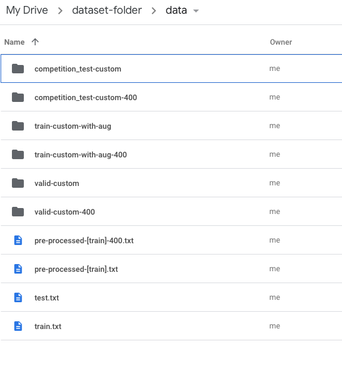
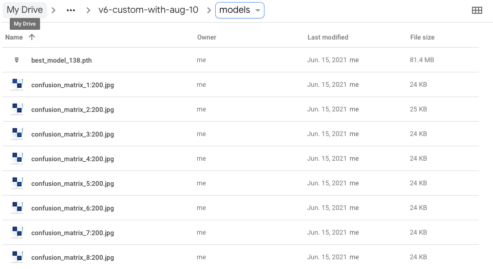
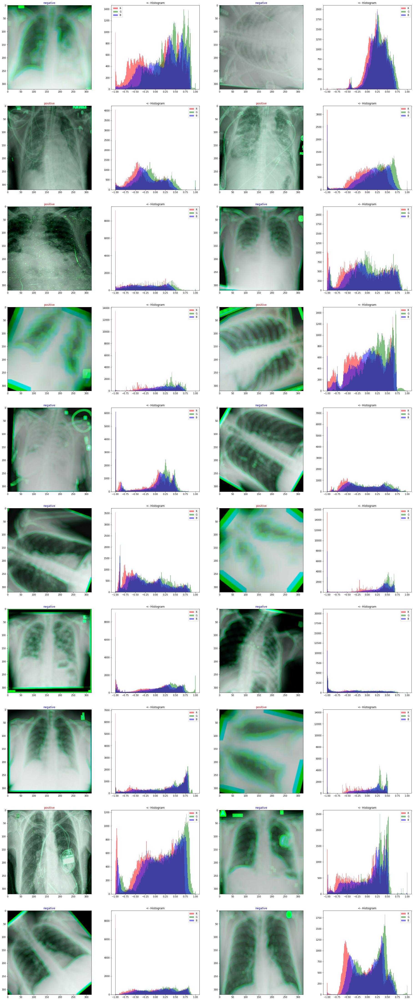

# Covid X-ray ML Competition

## About Competition
- Competition Details: https://r7.ieee.org/montreal-sight/ai-against-covid-19/#Dates
- Dataset (Kaggle): https://www.kaggle.com/andyczhao/covidx-cxr2
- eval.ai (Submission): https://eval.ai/web/challenges/challenge-page/925/evaluation

### Opening Ceremony Notes:

- eval.ai registration of participation starts May 31st
- You may use test (more like validation) and train dataset for training the model
- test dataset is unknown


## Instructions
### Evaluation / Use the pre-trained model:
1. Download / Clone this repo.
2. Modify list path of images in ```src_code/eval.py``` and model path:
    ```py
    imgs = ["/home/jx/JX_Project/covid-xray-detection/data/competition_test/{}.png".format(id) for id in range(1, 401)]
    # evaluate:
    output = eval(
        list_of_images=imgs, 
        model_path="/home/jx/JX_Project/covid-xray-detection/output/CUSTOM-MODEL/v6-custom-with-aug-10/models/best_model_138.pth",
    )
    print(output)
    ```
3. run model ```$ python src_code/eval.py```
- Note: there will be a cache folder created to generate reduced images from provided images.
- The best model it uses is captured at the 107 epoch: ```v6-custom-with-aug-10/models/best_model_138.pth``` [Link to the model](https://github.com/JXproject/covid-xray-detection/blob/master/output/CUSTOM-MODEL/v6-custom-with-aug-10/models/best_model_138.pth) (This is the model, and it is not model_state, so you can just use it without prior knowledge of the model. But the script do support any model state input.)

### Local Machine Setup:
1. Download / Clone this repo.
2. Download the original dataset from Kaggle (https://www.kaggle.com/andyczhao/covidx-cxr2), unzip subdirectories into the ```data``` folder
3. Pre-process the dataset to a new set of balanced and augmented dataset for training, validation, and competition-testing:
    1. Change the absolute path in ```src_code/tool_data_gen.py```, with default below (line 20):
        ```py
        ## USER DEFINED:
        ABS_PATH = "/Users/jaku/JX-Platform/Github/Covidx-clubhouse" # Define ur absolute path here
        ```
    2.  Ensure all settings are expected for the run, with default below (line 68-75):
        ```py
        # %% USER DEFINE ----- ----- ----- ----- ----- -----
        #######################
        ##### PREFERENCE ######
        #######################
        FEATURE_CONVERT_ALL_DATA_PRE_PROCESS = True # (Validation/Test) Only with differential augmentation for  RGB channels
        FEATURE_DATA_PRE_PROCESS_V2 = True # (Training) Additional dataset with rotation and zoom augmentation, with differential augmentation for  RGB channels
        TRAIN_NEW_IMG_SIZE = (320,320)
        TEST_NEW_IMG_SIZE = TRAIN_NEW_IMG_SIZE # None for original size
        ```
    3.  Start the pre-processing in terminal: ```$ python src_code/tool_data_gen.py```
4. Automatic pipeline for training and validating the model with the pre-processed dataset:
    1. Change the absolute path in ```src_code/tool_data_gen.py```, with default below (line 36):
        ```py
        ## USER DEFINED:
        ABS_PATH = "/home/jx/JXProject/Github/covidx-clubhouse" # Define ur absolute path here
        ```
    2.  Ensure all settings are expected for the run, with default below (line 48-58):
        ```py
        # %% USER OPTION: ----- ----- ----- ----- ----- ----- ----- ----- ----- #
        #######################
        ##### PREFERENCE ######
        #######################
        # SELECTED_TARGET = "1LAYER" # <--- select model !!!
        SELECTED_TARGET = "CUSTOM-MODEL" # <--- select model !!!
        USE_PREPROCESS_AUGMENTED_CUSTOM_DATASET_400 = False # use 400x400 resolution
        USE_PREPROCESS_CUSTOM_DATASET = True # True, to use dataset generated by 'tool_data_gen.py' (differential RGB only)
        USE_PREPROCESS_AUGMENTED_CUSTOM_DATASET = True # True, to use dataset generated by 'tool_data_gen.py' (differential RGB  + Augmentation)
        PRINT_SAMPLES = True
        OUTPUT_MODEL = False
        ```
        and (line 241-273)
        ```py
        # %% INIT: ----- ----- ----- ----- ----- ----- ----- ----- ----- ----- #
        #############################
        ##### MODEL DEFINITION ######
        #############################
        ### MODEL ###
        MODEL_DICT = {
            "CUSTOM-MODEL": { # <--- name your model
                "model":
                    nn.Sequential(
                        # Feature Extraction:
                        ResNet(BasicBlock, [3, 4, 6, 3], num_classes=2), # ResNet 34
                        # Classifier:
                        nn.Softmax(dim=1),
                    ),
                "config":
                    PredictorConfiguration(
                        VERSION="v6-custom-with-aug-10", # <--- name your run
                        OPTIMIZER=optim.SGD,
                        LEARNING_RATE=0.01,
                        BATCH_SIZE=50,
                        TOTAL_NUM_EPOCHS=200,#50
                        EARLY_STOPPING_DECLINE_CRITERION=30,
                    ),
                "transformation":
                    transforms.Compose([
                        # same:
                        # transforms.Resize(320),
                        transforms.CenterCrop(320),
                        transforms.ToTensor(),
                        transforms.Normalize((0.5), (0.5)),
                    ]),
            },
        }
        ```
    3. Kick off the training: ```$ python src_code/main_covid_prediction.py```
9. Pick the best version based on log file (```output/CUSTOM-MODEL/v6-custom-with-aug-10/log.txt```) and confusion matrix images in ```output/CUSTOM-MODEL/v6-custom-10/models/``` directory

### Colab Setup:
1. Download / Clone this repo locally
2. Upload the jupyter notebook via Colab
3. Create a ```dataset-folder``` directory on Google Drive (so we only have to mount the drive upon reconnection)
    1. Create ```dataset-folder/data``` sub-directory (as the image shown below)
       
    2. [Option 1] Upload the dataset to the Google Drive (>10 GB)
    3. [Option 2: Recommended] You may follow the local instruction **Step_8** to pre-compile the dataset locally, and upload the reduced and preprocessed dataset (<2 GB)
    4. Create ```dataset-folder/lib``` and upload all the library source code from ```src_code``` directory
4. Run the jupyter book:
    1. Change settings as suggested in local guide
    2. Make sure the absolute directory is as expected:
    ```py
    ## USER DEFINED:
    ABS_PATH = "/content/drive/MyDrive/dataset-folder" # Define ur 
    ```
    3. Run **Cell_1** to make sure you are using GPU (Colab Pro recommended!)
    4. Run **Cell_2** to mount your google drive that contains the ```dataset-folder```
    5. [If you did not have dataset] Uncomment **Cell_3** to download dataset directly from Kaggle and **Cell_4** to pre-process dataset (make sure your absolute directory in ```lib/tool_data_gen.py``` is correct)
    6. Run the rest!
7. Pick the best result from the google drive (same as the local guide but in the CLOUD ☁️)
    


## Documentation:
### Background:
1. Understanding resnet from scratch: https://jarvislabs.ai/blogs/resnet
2. Checklist on squeezing the shit out of your model: http://karpathy.github.io/2019/04/25/recipe/

### Our Best Run:
- Local (Python): https://github.com/JXproject/covid-xray-detection/blob/master/src_code/main_covid_prediction.py
- Colab Version (Best Jupyter Notebook): https://github.com/JXproject/covid-xray-detection/blob/master/src_code/covid-colab.ipynb
- Log File: https://github.com/JXproject/covid-xray-detection/blob/master/output/CUSTOM-MODEL/v6-custom-with-aug-10/log.txt
- Confusion matrix: 

### Hardware:
- Local: GTX 980 Ti
- Cloud: Google Colab Pro

### Description:
- There are two approaches to make a better predictions on given dataset:
    1. Use a decent model that works well with the task.
    2. Engineer the dataset to make the model more efficient and effective when learning.
    
- The base model is a simple and basic **Resnet34** (https://jarvislabs.ai/blogs/resnet), for its lightweight and adaptive properties for the given task on chest COVID detection.

- Due to limitation of my hardware (only have a GTX980Ti 6GB), I was not able to go with a deeper model and pytorch built-in model. The **Resnet34** was selected for the task, resulting a 70-80% accuracies on the evaluation test dataset provided.

- The training dataset was discovered to be quite imbalanced:
  
    
    
- For simplicity, the dataset is randomly downsampled for -ve dataset, with +ve dataset unchanged.

- To further improve the performance, we start to engineer the dataset to better utilize the model we use:
    - The initial thought is that the provided image has RGB channels exactly same to provide a black and white image, hence three channels have duplicated information, which is redundant for **Resnet34**.
    - In classical computer vision, we would use morphological operators (dilation and erosion) to extract features from the image. In addition, we figure out whether patient has COVID-19 based on the abnormal features within the chest scan. As a result, the idea is to provide **Resnet34** a sense of where the the chest region is and where the features are, with dilation and erosion respectively. Hence, we can utilize the three channels with R:(gray image), G:(erosion image), B:(dilation image), and the **Resnet34** can now fully utilize all three channels to produce a better prediction:
        
    - Sample training dataset becomes:
        
    
- As a result, the performance is quite well:

    
    
- Lastly, to further push the model performance and robustness, we doubled the dataset with random zoom and rotation. To note, we have also tweaked around the learning rate and stopping criteria to find the best parameters

- To note, we pre-generate the training dataset in advance to improve the run-time efficiency.

- Overall, the best competition scored model (with just 107 epochs): 

    
    
- Ranking (s1/28):

    
    
- Output:
```
[2021-06-15 22:58:19.149098]: > epoch 107/200:
[2021-06-15 22:58:19.151170]:   >> Learning (wip) 
[2021-06-15 22:59:51.925127]:   >> Testing (wip) 
[2021-06-15 22:59:54.826188]:     epoch 107 > Training: [LOSS: -0.9966 | ACC: 0.9969] | Testing: [LOSS: -0.9927 | ACC: 0.9950] Ellapsed: 92.77 s | rate:2.89743

[2021-06-15 22:59:54.844606]: > Found Best Model State Dict saved @/content/drive/MyDrive/dataset-folder/output/CUSTOM-MODEL/v6-custom-with-aug-10/models/best_state_dict_107:200.pth [False]
[2021-06-15 22:59:55.005173]: Best Classification Report:
----------------------
[2021-06-15 22:59:55.007065]:               precision    recall  f1-score   support

    positive       0.99      1.00      1.00       200
    negative       1.00      0.99      0.99       200

    accuracy                           0.99       400
   macro avg       1.00      0.99      0.99       400
weighted avg       1.00      0.99      0.99       400
```
